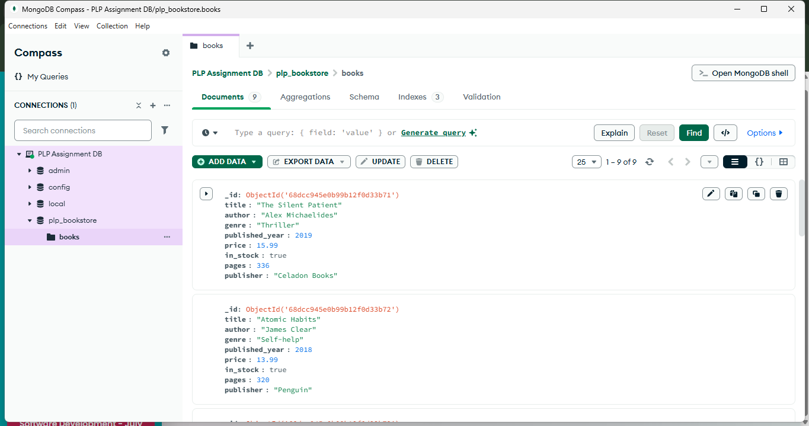

# 📘 MongoDB Week 1 Assignment – Data Layer Fundamentals

## 📸 MongoDB Compass Screenshot




## 🛠️ Setup Instructions

Before running the scripts, make sure you have the following installed:

- MongoDB Community Edition (includes MongoDB Shell)
- MongoDB Compass
- Node.js (v18 or higher)

### Install Dependencies

In your assignment folder, run:

```bash
npm init -y
npm install mongodb
```

---

## ▶️ How to Run the Scripts

### 1. Insert Book Data

This script adds 10 sample books to the `plp_bookstore` database:

```bash
node insert_books.js
```

### 2. Run All Queries

This script performs CRUD operations, advanced queries, aggregation pipelines and indexing:

```bash
node queries.js
```

---

## 📂 Files Included

- `insert_books.js` – Inserts sample book documents
- `queries.js` – Contains all required MongoDB queries
- `README.md` – How to setup the requirements  run the code 
- Screenshot – MongoDB Compass showing `plp_bookstore` and `books` collection

---

## 📊 Indexing and Performance

Indexes created:

- Single-field index on `title`
- Compound index on `author` and `published_year`

Performance was analyzed using `.explain("executionStats")`, showing reduced document scans and improved query efficiency.

---

## ✅ Submission Checklist

- [x] `insert_books.js` with sample data
- [x] `queries.js` with all required queries
- [x] `README.md` with setup and usage instructions
- [x] Screenshot of MongoDB Compass showing `plp_bookstore` and `books` collection


